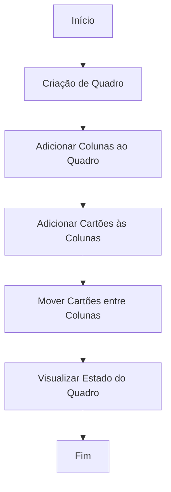

# 🗂️ Board Management System

Um sistema simples em Java para gerenciar quadros estilo Kanban, com colunas e cartões. Ideal para fins educativos ou como base para sistemas de gestão de tarefas.

---

## 🔧 Tecnologias

- Java
- Gradle (Kotlin DSL)
- Estrutura MVC
- Liquibase (para versionamento de banco)
- Arquitetura modular

---

## 🚀 Como rodar o projeto

1. Clone o repositório:
   ```bash
   git clone https://github.com/seu-usuario/board-project.git
   cd board-project
   ```

2. Compile o projeto:
   ```bash
   ./gradlew build
   ```

3. Rode a aplicação:
   ```bash
   ./gradlew run
   ```

---

## 🧠 Funcionalidades

- Criar quadros com colunas (To Do, Doing, Done, etc)
- Criar cartões dentro das colunas
- Mover cartões entre colunas
- Visualizar o estado atual do quadro

---

## 🧭 Estrutura do Projeto

- `controller/`: Manipula requisições e direciona ações
- `dto/`: Define os objetos utilizados para transporte de dados
- `entity/`: Contém as classes que representam os dados do sistema
- `service/`: Contém a lógica de negócio

---

## 🔄 Fluxo Principal



---

## 📂 Exemplo de Quadro

```
[To Do]        [Doing]        [Done]
- Task 1       - Task 2       - Task 3
- Task 4
```

---

## 📜 Licença

Este projeto é open-source e pode ser usado livremente para fins educacionais.
