# 📋 Board Management System (Kanban Style)

Projeto Java voltado à gestão de tarefas em quadros do tipo Kanban, com funcionalidades robustas de manipulação de colunas, cartões, bloqueios, histórico e menu interativo via console.

---

## 🚀 Funcionalidades

- ✅ Criar quadros e colunas (To Do, Doing, Done, etc.)
- ✅ Adicionar cartões às colunas
- 🔁 Mover cartões entre colunas com regras de bloqueio
- 🚫 Tratar exceções específicas de fluxo (ex: cartões bloqueados ou finalizados)
- 🧠 Menu interativo para operações (UI)
- 📦 Controle de histórico de cartões
- 📄 Camadas bem definidas: DTO, DAO, Services, Entities

---

## 🧱 Estrutura do Projeto (MVC Avançado)

```
src/main/java/br/com/dio/
│
├── controller/               # Controladores principais (BoardController)
├── dto/                      # Objetos de transferência de dados (DTOs)
├── entity/                   # Entidades do domínio: Board, Column, Card, Block
├── exception/                # Exceções personalizadas
├── persistence/              # DAO, configurações, entidades persistentes
│   ├── config/               # Configuração do banco
│   ├── converter/            # Conversores de tipo (ex: datas)
│   ├── dao/                  # Objetos de acesso a dados
│   ├── entity/               # Entidades JPA
│   └── migration/            # Estratégias de migração (Liquibase)
├── service/                  # Lógica de negócio (CRUD, regras, queries)
├── ui/                       # Menu principal e de quadros (interação CLI)
└── Main.java                 # Ponto de entrada da aplicação
```

---

## 📌 Pacotes e Classes Importantes

### 🎯 UI
- `MainMenu.java` — Menu principal de operações
- `BoardMenu.java` — Interface de manipulação de quadros

### 📦 Entidades
- `BoardEntity`, `BoardColumnEntity`, `CardEntity`, `BlockEntity`

### 💼 Services
- `BoardService`, `CardService` — Lógica principal
- `BoardQueryService`, `CardQueryService`, `BoardColumnQueryService` — Consultas especializadas

### 🧰 DAO
- `BoardDAO`, `BoardColumnDAO`, `CardDAO`, `BlockDAO`

### 📄 DTOs
- `BoardDetailsDTO`, `BoardColumnDTO`, `BoardColumnInfoDTO`, `CardDetailsDTO`

### 🚨 Exceções
- `CardBlockedException`, `CardFinishedException`, `EntityNotFoundException`

### ⚙️ Outras Classes
- `MigrationStrategy` — Executa migração inicial
- `ConnectionConfig` — Configuração do banco de dados
- `OffsetDateTimeConverter` — Conversão de datas

---

## 🔄 Diagrama Mermaid (Arquitetura e Fluxo)

```mermaid
flowchart TB

subgraph Interface [🖥️ Interface do Usuário]
    A[👤 Usuário] --> B[🧭 MainMenu / BoardMenu]
end

subgraph Controller
    B --> C[🎮 BoardController]
end

subgraph Service
    C --> D1[📦 BoardService]
    C --> D2[📦 CardService]
    C --> D3[🔍 BoardQueryService]
    C --> D4[🔍 CardQueryService]
    C --> D5[🔍 BoardColumnQueryService]
end

subgraph DAO
    D1 --> E1[💾 BoardDAO]
    D1 --> E2[💾 BoardColumnDAO]
    D2 --> E3[💾 CardDAO]
    D2 --> E4[💾 BlockDAO]
end

subgraph Entity
    E1 --> F1[🧱 BoardEntity]
    E2 --> F2[🧱 BoardColumnEntity]
    E3 --> F3[🧱 CardEntity]
    E4 --> F4[🧱 BlockEntity]
end

subgraph DTO
    D1 --> G1[📤 BoardDetailsDTO]
    D1 --> G2[📤 BoardColumnDTO]
    D2 --> G3[📤 CardDetailsDTO]
end

subgraph Exceptions
    D2 --> H1[🚫 CardBlockedException]
    D2 --> H2[🚫 CardFinishedException]
    D1 --> H3[🚫 EntityNotFoundException]
end

subgraph Outros
    I1[⚙️ MigrationStrategy]
    I2[🔌 ConnectionConfig]
    I3[🕒 OffsetDateTimeConverter]
end

```



---

Criado por Álvaro Silva

